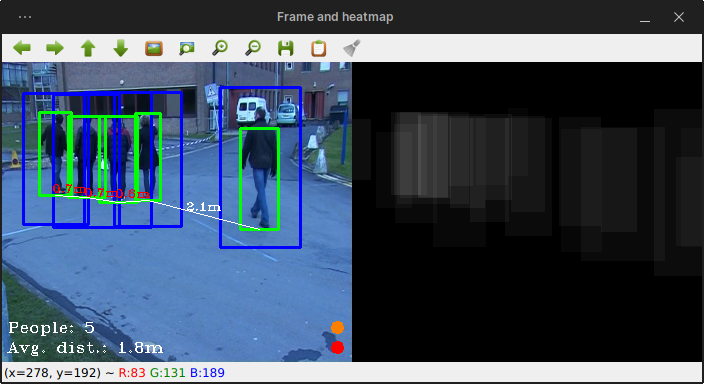
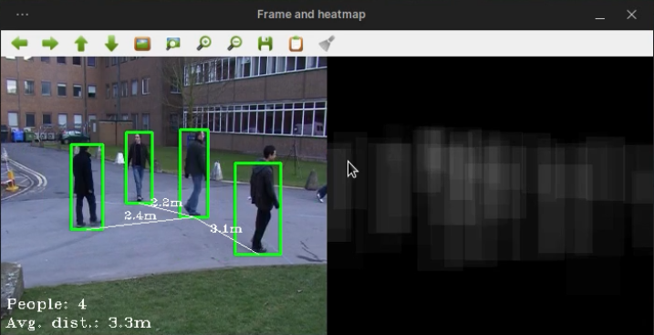
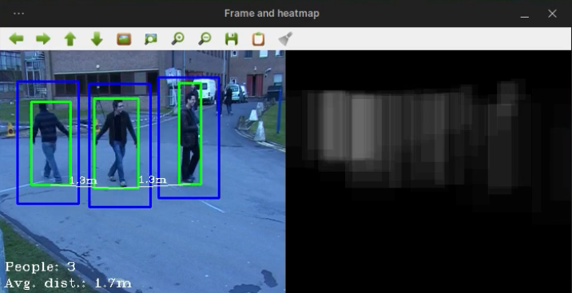
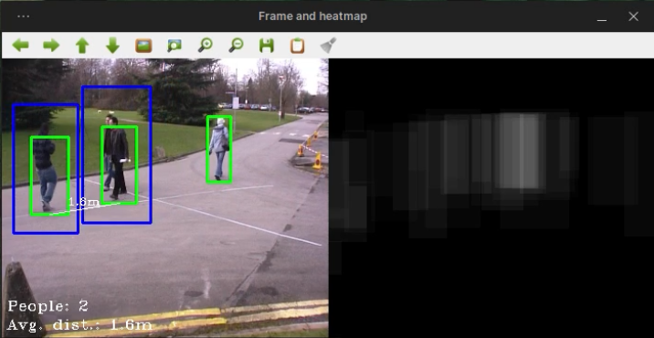
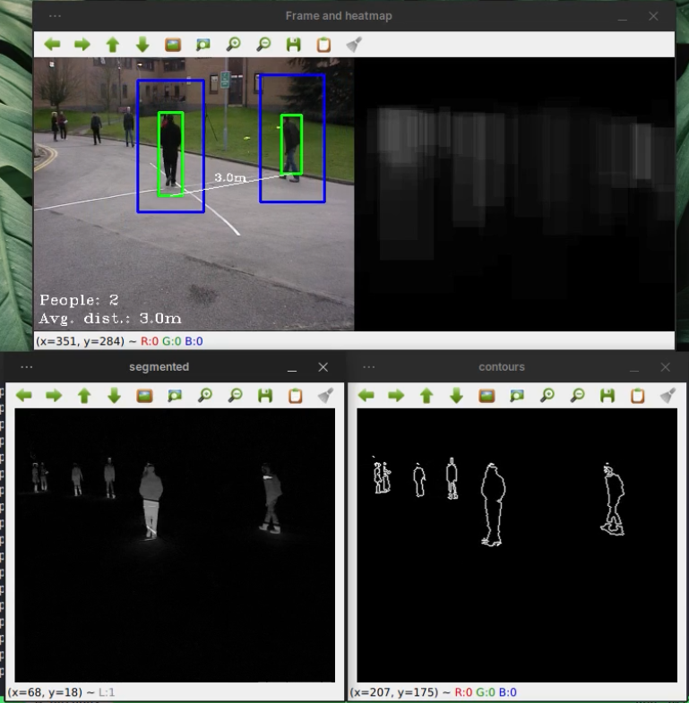
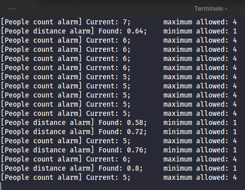

# HumanCount

This repository contains the final project's code for the **Computer Vision** course at Sapienza University of Rome (A.Y. 2021-22).



The project does **real-time human counting** using HOG and SVM, and it is intended to be used to **monitor a known area**. In addition to counting, the program:

* Estimates the **distance** between people.
* Outputs visual and terminal **alarms** when:
  * The number of people is higher than the maximum allowed.
  * The minimum distance between people is less than the minimum allowed.
* Shows an evolving **heat-map**, to describe the density of the people over certain areas, over time.

The main goal of the project was to improve the size of the bounding boxes, also in order to give better distance estimations. To reach this goal, the approaches described in the paper **Human Detection Using HOG-SVM, Mixture of Gaussian and Background Contours Subtraction** by *A. H. Ahmed, K. Kpalma and A. O. Guedi* has been used as a reference.

*A. H. Ahmed, K. Kpalma and A. O. Guedi, "[Human Detection Using HOG-SVM, Mixture of Gaussian and Background Contours Subtraction](https://ieeexplore.ieee.org/document/8334767/)," 2017 13th International Conference on Signal-Image Technology & Internet-Based Systems (SITIS), 2017, pp. 334-338, doi: 10.1109/SITIS.2017.62.*

## Prerequisites

The only requirements to run the project are:

* OpenCV 4.5.3+
* NumPy

## Running

The entry-point is the `main.py` script, which can be configured via multiple command line arguments; specifically:

```
usage: main.py [-h] -i INPUT [-sh] [-nf] [-m] [-nac] [-nad] [-s]

optional arguments:
  -h, --help            show this help message and exit
  -i INPUT, --input INPUT
                        Input JSON
  -sh, --show-hog-boxes
                        Show the bounding boxes produced by HOG-SVM
  -nf, --no-filter-optimized-boxes
                        Also show the optimized bounding boxes that are outside the HOG-SVM ones
  -m, --use-mog2        Use MOG2 to perform background subtraction
  -nac, --no-alarm-count
                        Disable the alarm when the number of people exceedes the limit
  -nad, --no-alarm-distance
                        Disable the alarm when there is a distance smaller that the minimum limit allowed
  -s, --show            Show some intermediate preprocessing steps in a window
```

By default, the script looks for the still `background` image provided in the input JSON; alternatively, if the `--use-mog2` option is provided, the background will be extracted in real-time for each frame.

### JSON configuration

The main script needs a JSON file as input, containing the configuration of the video/feed to use, for example:

```json
{
    "video": "5.mp4",
    "background": "5.png",
    "camera_conf": {
        "height": 2.0,
        "lower_angle": 55,
        "upper_angle": 100
    },
    "alarms": {
        "max_people": 4,
        "min_distance": 1
    }
}
```

* If not available, the background image can be estimated from an already made video, by using the `background_estimator.py` script.
* The `camera_conf` section contains the known values of the camera, that are used to estimate the distance between the camera and the people.
* The `alarms` section contains parameters/rules to decide when to raise an alarm state.

### Examples

This section contains some example, explaining the outcome of certain command line arguments.

```bash
# show the filtered optimized boxes (default)
python3 main.py -i datasets/5.json
```



```bash
# also show the hog-generated bounding boxes (blue)
python3 main.py -i datasets/6.json --show-hog-boxes
```



```bash
# also show the hog-generated bounding boxes (blue), and show the optimized ones even if they are not in an hog box (no filter)
python3 main.py -i datasets/7.json --show-hog-boxes --no-filter-optimized-boxes
```



```bash
# also show the hog-generated bounding boxes (blue),
# and some preprocessing steps in separate windows (segmentation, countours extraction)
python3 main.py -i datasets/8.json --show-hog-boxes --show
```



### Terminal output

In case of alarms, in addition to the visual signals (colored circles in the right bottom, and colored distances), there is a terminal output that can be logged:


